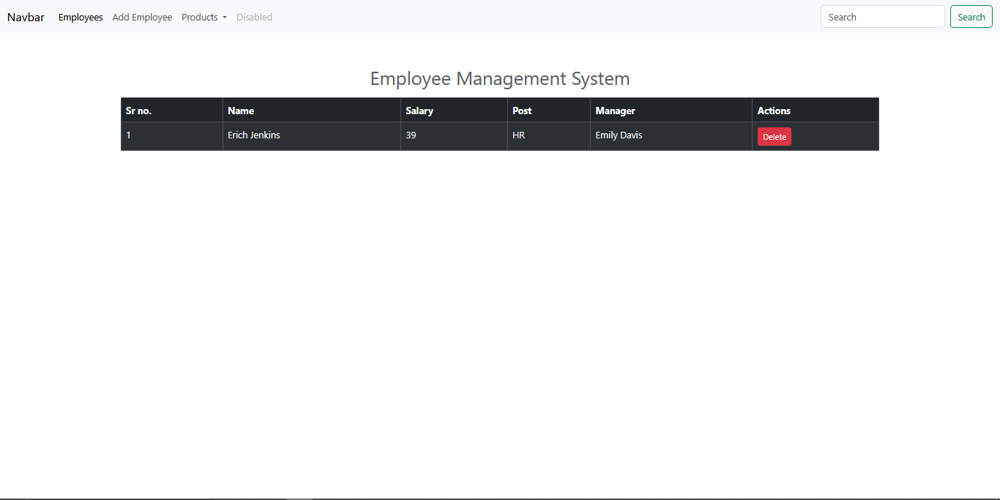

# PR-Repetition JS

A modern Employee and Product Management System built with HTML, CSS (Bootstrap 5), and JavaScript.  
Live Demo: [https://pr-repetition-js.vercel.app/](https://pr-repetition-js.vercel.app/)


## Screenshot

---

## Features

### Employee Management
- View all employees in a stylish table
- Add new employees with details (name, salary, post, manager)
- Delete employees instantly

### Product Management
- Add new products with image, price, stock, and type
- View products in a modern glassmorphism card layout
- Add products to cart with `+` and `-` buttons for quantity control
- Cart data is stored in localStorage

### UI/UX
- Responsive design using Bootstrap 5
- Modern glassmorphism theme for product cards
- Gradient backgrounds and smooth hover effects
- Clean, user-friendly forms

---

## Getting Started

1. **Clone or Download**
   ```
   git clone https://github.com/your-username/pr-repetition-js.git
   ```
2. **Open the project folder in VS Code or your favorite editor.**
3. **Open `index.html` in your browser to get started.**

---

## Folder Structure

```
PR-Repetition JS/
│
├── index.html           # Employee list
├── add_emp.html         # Add employee form
├── product.html         # Product list & cart
├── add_product.html     # Add product form
├── js/
│   ├── script.js        # Employee logic
│   ├── product.js       # Product & cart logic
│   └── prodform.js      # Add product logic
└── README.md
```

---

## Tech Stack

- HTML5
- CSS3 (Bootstrap 5, custom styles)
- JavaScript (ES6)
- [Bootstrap Icons](https://icons.getbootstrap.com/) (for UI icons)
- [Vercel](https://vercel.com/) for deployment

---

## Screenshots

> 
> 
> 

---

## License

This project is for educational/demo purposes.

---

**Live Demo:** [https://pr-repetition-js.vercel.app/](https://pr-repetition-js.vercel.app/)